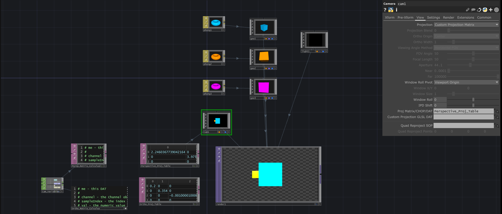

# Perspective projection matrix setup
  
   

# Orthogonal projection matrix setup
  

Ressources i used : 
  - https://www.scratchapixel.com/lessons/3d-basic-rendering/perspective-and-orthographic-projection-matrix/projection-matrix-introduction
  - https://arxiv.org/pdf/2208.09549
