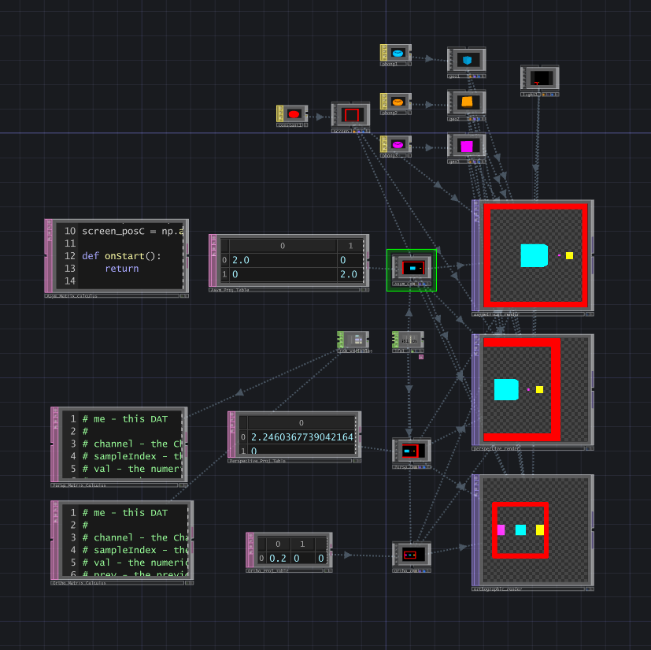

# Kooima projection matrix

'''Top render using Kooima's projection matrix ''' 
Middle render using Perspective projection matrix  
Bottom render using Orthogonal projection matrix  
  

Ressources :
  - https://jsantell.com/portals-with-asymmetric-projection/
  - https://en.wikibooks.org/wiki/Cg_Programming/Unity/Projection_for_Virtual_Reality
